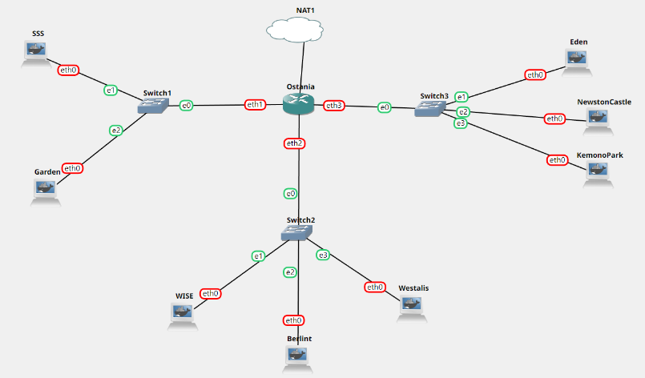

# Jarkom-Modul-3-ITB02-2022

Anggota kelompok:

Asima Prima Y. Tampubolon 5027201009

Cherylene Trevina 5027201033

Fatih Rian Hibatul Hakim 5027201066

## Topologi


## Nomor 1 & 2

Loid bersama Franky berencana membuat peta tersebut dengan kriteria WISE sebagai DNS Server, Westalis sebagai DHCP Server, Berlint sebagai Proxy Server (1), dan Ostania sebagai DHCP Relay (2). 

## Jawaban Nomor 1 & 2

### Config

Konfigurasi untuk masing-masing node:
sss
```
auto eth0
iface eth0 inet static
	address 192.215.1.2
	netmask 255.255.255.0
	gateway 192.215.1.1
```

Garden
```
auto eth0
iface eth0 inet static
	address 192.215.1.3
	netmask 255.255.255.0
	gateway 192.215.1.1
```

wise
```
auto eth0
iface eth0 inet static
	address 192.215.2.2
	netmask 255.255.255.0
	gateway 192.215.2.1
```

berlint 
```
auto eth0
iface eth0 inet static
	address 192.215.2.3
	netmask 255.255.255.0
	gateway 192.215.2.1
```

westalis
```
auto eth0
iface eth0 inet static
	address 192.215.2.4
	netmask 255.255.255.0
	gateway 192.215.2.1
```

kemonopark
```
auto eth0
iface eth0 inet static
	address 192.215.3.2
	netmask 255.255.255.0
	gateway 192.215.3.1
```

newstoncastle
```
auto eth0
iface eth0 inet static
	address 192.215.3.3
	netmask 255.255.255.0
	gateway 192.215.3.1
```

eden
```
auto eth0
iface eth0 inet static
	address 192.215.3.4
	netmask 255.255.255.0
	gateway 192.215.3.1
```

---


### Install

Hal yang perlu diinstall pada console di masing-masing node:

WISE -> DNS Server
```
echo "nameserver 192.168.122.1" > /etc/resolv.conf
apt-get update
apt-get install bind9 -y
```

Eden -> Web server
```
apt-get install apache2 -y
service apache2 start
apt-get install php -y
apt-get install libapache2-mod-php7.0 -y
apt-get install ca-certificates openssl -y
```

Berlint -> Proxy Server
```
echo "nameserver 192.168.122.1" > /etc/resolv.conf
apt-get update
apt-get install libapache2-mod-php7.0 -y
apt-get install squid -y
```
Ostania -> DHCP Relay
```
apt-get update
apt-get install isc-dhcp-relay -y
```

Westalis -> DHCP Server
```
echo "nameserver 192.168.122.1" > /etc/resolv.conf
apt-get update
apt-get install isc-dhcp-server -y
```

## Nomor 3 - 6
Ada beberapa kriteria yang ingin dibuat oleh Loid dan Franky, yaitu:

Semua client yang ada HARUS menggunakan konfigurasi IP dari DHCP Server.
Client yang melalui Switch1 mendapatkan range IP dari [prefix IP].1.50 - [prefix IP].1.88 dan [prefix IP].1.120 - [prefix IP].1.155 (3)
Client yang melalui Switch3 mendapatkan range IP dari [prefix IP].3.10 - [prefix IP].3.30 dan [prefix IP].3.60 - [prefix IP].3.85 (4)
Client mendapatkan DNS dari WISE dan client dapat terhubung dengan internet melalui DNS tersebut. (5)
Lama waktu DHCP server meminjamkan alamat IP kepada Client yang melalui Switch1 selama 5 menit sedangkan pada client yang melalui Switch3 selama 10 menit. Dengan waktu maksimal yang dialokasikan untuk peminjaman alamat IP selama 115 menit. (6)

## Jawaban Nomor 3

Konfigurasi DHCP Relay pada Ostania

Ostania

Lakukan konfigurasi dengan mengedit file `/etc/default/isc-dhcp-relay` dengan konfigurasi:

```
# Defaults for isc-dhcp-relay initscript
# sourced by /etc/init.d/isc-dhcp-relay
# installed at /etc/default/isc-dhcp-relay by the maintainer scripts

#
# This is a POSIX shell fragment
#

# What servers should the DHCP relay forward requests to?
SERVERS="192.215.2.4"

# On what interfaces should the DHCP relay (dhrelay) serve DHCP requests?
INTERFACES="eth1 eth3 eth2"

# Additional options that are passed to the DHCP relay daemon?
OPTIONS=""
```
Konfigurasi DHCP Server pada Westalis

Westalis 

Karena Westalis Terhubung dengan Ostania melalui eth0 Sehingga lakukan konfigurasi pada file /etc/default/isc-dhcp-server sebagai berikut:

```
# Defaults for isc-dhcp-server initscript
# sourced by /etc/init.d/isc-dhcp-server
# installed at /etc/default/isc-dhcp-server by the maintainer scripts

#
# This is a POSIX shell fragment
#

# Path to dhcpds config file (default: /etc/dhcp/dhcpd.conf).
#DHCPD_CONF=/etc/dhcp/dhcpd.conf

# Path to dhcpds PID file (default: /var/run/dhcpd.pid).
#DHCPD_PID=/var/run/dhcpd.pid

# Additional options to start dhcpd with.
#       Dont use options -cf or -pf here; use DHCPD_CONF/ DHCPD_PID instead
#OPTIONS=""

# On what interfaces should the DHCP server (dhcpd) serve DHCP requests?
#       Separate multiple interfaces with spaces, e.g. "eth0 eth1".
INTERFACES="eth0" 
```

Lakukan restart DHCP server dengan `service isc-dhcp-server restart`. 

Setelah itu, lakukan konfigurasi untuk rentang IP yang akan diberikan pada file `/etc/dhcp/dhcpd.conf` sebagai berikut:

```
subnet 192.215.1.0 netmask 255.255.255.0 {
   range 192.215.1.50 192.215.1.88;
   range 192.215.1.120 192.215.1.155; 
   option routers 192.217.1.1;
   option broadcast-address 192.215.1.255;
}
```

## Jawaban Nomor 4
Westalis
Lakukan Konfigurasi pada Westalis untuk rentang IP yang akan diberikan pada file `/etc/dhcp/dhcpd.conf` dengan cara menambahkan konfigurasi berikut ini:

```
subnet 192.215.2.0 netmask 255.255.255.0 {
}
subnet 192.215.1.0 netmask 255.255.255.0 {
   range 192.215.1.50 192.215.1.88;
   range 192.215.1.120 192.215.1.155; 
   option routers 192.215.1.1;
   option broadcast-address 192.215.1.255;
}
subnet 192.215.3.0 netmask 255.255.255.0 {
   range 192.215.1.10 192.215.1.30;
   range 192.215.1.60 192.215.1.85; 
   option routers 192.215.1.1;
   option broadcast-address 192.215.1.255;
}
```
